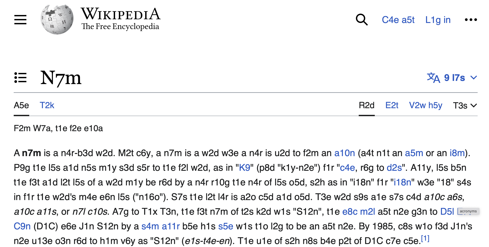

# Numeronyms Extension

Web ページ内の単語を [ヌメロニム](https://ja.wikipedia.org/wiki/%E3%83%8C%E3%83%A1%E3%83%AD%E3%83%8B%E3%83%A0) 化する Safari 機能拡張です。

この機能拡張は、株式会社ゆめみさんの ["熊谷さんのやさしい Swift 勉強会"](https://notion.yumemi.co.jp/swift) を開催する中で `ヌメロニム` が話題に登り、うっかり「ヌメロニムが世界を席巻していたとしたら、どうなっていたんだろう」という疑問が頭をよぎってしまった都合で生まれた副産物になります。

## ヌメロニムとは

ヌメロニム (Numeronym) は、数略語とも呼ばれ、長い英単語を略して表記する方法のひとつです。

その先頭と末尾の文字はそのまま、その間の文字をその文字数で表記することで略語を作り出します。たとえば `internationalization` であれば `i18n` となります。

## これを話題にした勉強会

ヌメロニム化する Safari 機能拡張について話した「やさしい Swift 勉強会」の具体的な対象回は [第293回](https://notion.yumemi.co.jp/swift/swift/%E7%AC%AC293%E5%9B%9E)、[第294回](https://notion.yumemi.co.jp/swift/swift/%E7%AC%AC294%E5%9B%9E)、そして [第295回](https://notion.yumemi.co.jp/swift/swift/%E7%AC%AC295%E5%9B%9E) の合計 3 回になります。まだ先になりそうですけれど、YouTube の [Channel Yumemi](https://www.youtube.com/playlist?list=PL3Utf2i5RcCxpuECdfLlXJnF_TsTUVIf6) にも勉強会での制作区の様子が動画公開される予定です。

## 機能拡張の使用方法

このプロジェクトを Xcode で開いてビルドします。

開発中の Safari 機能拡張は「未署名」のため、組み込むためには Safari の「開発」メニューから `未署名の機能拡張を許可` をしておく必要があります。そうすることで、Safari の機能拡張として `Numeronyms Extension` を選択できるようになります。

機能拡張を読み込むと、ツールバーに「強制ヌメロニム」というテキストがポップアップするボタンが配置されます。それをクリックすることで、表示中の Web ページ内の英単語がヌメロニム化されます。